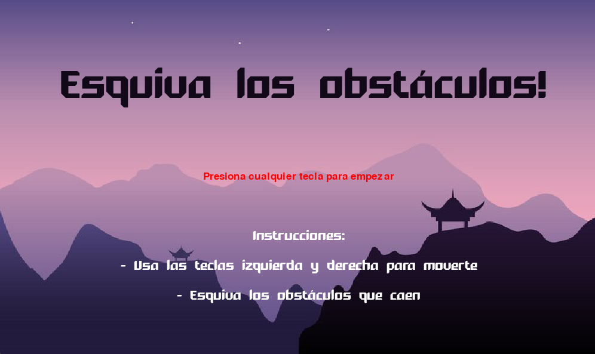
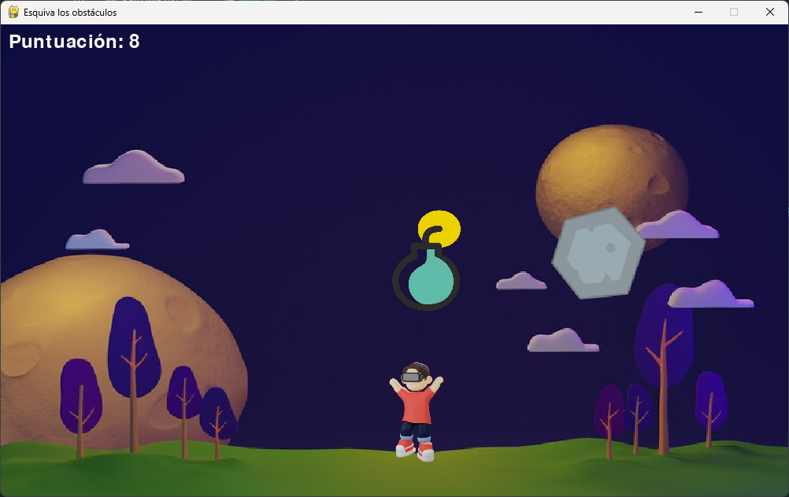

# Evita el Caos

## Descripción
El "Evita el Caos" es un emocionante juego de arcade en el que debes esquivar obstáculos y enemigos mientras intentas conseguir la puntuación más alta. ¡Pon a prueba tus reflejos y habilidades de esquivar en este desafío adictivo!

## Overview
<!-- inserta imagen del assets -->




## Instrucciones
1. **Requisitos previos**
   - Asegúrate de tener instalado Python en tu computadora. Puedes descargarlo desde [python.org](https://www.python.org/downloads/).

2. **Configuración del entorno**
   - Clona este repositorio o descarga el archivo ZIP.

3. **Instalación de dependencias**
   - Abre una terminal en la carpeta del juego.
   - Ejecuta el siguiente comando para instalar las dependencias necesarias:
     ```
     pip install pygame
     ```

4. **Ejecución del juego**
   - En la misma terminal, ejecuta el siguiente comando para iniciar el juego:
     ```
     python main.py
     ```

5. **Cómo Jugar**
   - Usa las teclas de flecha izquierda y derecha para moverte.
   - Evita los obstáculos y enemigos para sobrevivir y obtener puntos.
   - ¡Intenta conseguir la puntuación más alta!

6. **Pantalla de Game Over**
   - Cuando pierdas, verás una pantalla de "Juego Terminado" con tu puntuación.
   - Presiona la tecla "R" para jugar de nuevo.
   - Presiona la tecla "Q" para salir del juego.

## Créditos
- Desarrollado por Pedro Agames R.

¡Diviértete jugando!